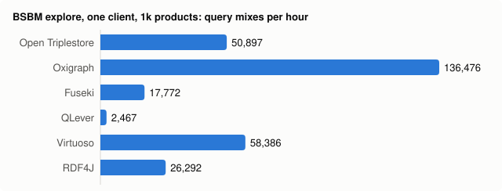
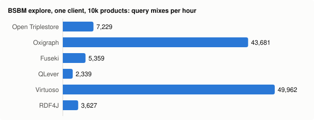

# Performance comparison with other open-source triplestores

Open Triplestore measured against five open-source triplestores on the same
machine, under the same container limits, with the same data and the same
query instances: Oxigraph server (the engine this store embeds, upstream and
unpatched), Apache Jena Fuseki, QLever, Virtuoso Open Source and Eclipse RDF4J.

> **Measured 2026-10-03** on one Apple M1 Pro laptop (16 GB) in Docker, against
> Open Triplestore 0.7.0 at commit `570a7a30` (develop). Two BSBM scales: 1,000
> products (0.37 M triples) and 10,000 products (3.56 M triples). Every number
> below comes from [`docs/perf-data/2026-10-03/`](perf-data/2026-10-03/), produced
> by the harness in [`scripts/bench-compare/`](../scripts/bench-compare/). Read
> the [threats to validity](#7-threats-to-validity) before quoting a number.

## Contents

1. [Summary](#1-summary)
2. [Stores](#2-stores)
3. [Method](#3-method)
4. [Hardware and software](#4-hardware-and-software)
5. [Results](#5-results)
6. [Where Open Triplestore loses](#6-where-open-triplestore-loses)
7. [Threats to validity](#7-threats-to-validity)
8. [What was not measured](#8-what-was-not-measured)
9. [Reproduce it](#9-reproduce-it)

## 1. Summary

- **No store is fastest everywhere.** On the BSBM explore mix with one client,
  upstream Oxigraph leads at 1k products (136,476 query mixes per hour) and
  Virtuoso at 10k (49,962). Open Triplestore is third at 1k (50,897) and third
  at 10k (7,229), ahead of Fuseki, RDF4J and QLever.
- **Against its own engine, Open Triplestore loses.** It answers the explore
  mix 2.7× slower than upstream Oxigraph 0.5.11 at 1k and 6× slower at 10k,
  with the same answers. At 10k its in-memory accelerator is off (the store is
  over its 2 M-triple cap in a 4 GiB container), and DESCRIBE takes 43 ms
  against Oxigraph's 0.24 ms. A follow-up probe points at this store's own
  layer rather than the evaluator; it is tracked in [#468](https://github.com/philipperenzen/open-triplestore/issues/468).
- **Where it leads:** at 1k, with the accelerator on, it has the lowest median
  latency of the six on BSBM Q2, Q4 and Q5 and on the property-path queries F01 and F02,
  and whole-dataset SHACL validation takes 0.33 s against Fuseki's 0.98 s.
- **Loading is its slowest workload:** 44 k triples/s over the Graph Store
  protocol at both scales, where the other stores loaded the 10k file at
  101–476 k triples/s (it indexes every literal for full-text search as it
  loads). In the 4 GiB container the 10k load was **OOM-killed in 2 of 6 attempts**
  ([#469](https://github.com/philipperenzen/open-triplestore/issues/469)); SHACL
  validation at 10k peaked at 4,071 of 4,096 MiB.
- **Correlated `FILTER NOT EXISTS` is a cliff** for Open Triplestore, Oxigraph
  and RDF4J: 4.4 s, 112 s and 89 s at 1k, a timeout at 10k, against 23–170 ms
  for Virtuoso, QLever and Fuseki ([#471](https://github.com/philipperenzen/open-triplestore/issues/471)).
- **Answers were checked, not assumed.** Every query instance's result count is
  compared across stores. All stores agree on every SELECT and CONSTRUCT
  instance except Virtuoso, which returned a short answer with HTTP 200 for
  24 query executions at each scale, out of about 190,000–220,000 run under 4
  and 8 concurrent clients. DESCRIBE answers differ by design (RDF4J and Virtuoso include
  incoming triples). The harness also found a correctness bug in this store's
  `/sparql` for admins who write `FROM` ([#470](https://github.com/philipperenzen/open-triplestore/issues/470)).





## 2. Stores

Only open-source stores whose licences put no condition on publishing
benchmark results. Each licence text was read before the store was included.

| Store | Version | Licence | Storage and configuration |
|---|---|---|---|
| **Open Triplestore** | 0.7.0, `570a7a30` | this repository | RocksDB (Oxigraph 0.5.11) + in-memory accelerator; release build, `--features full` |
| **Oxigraph server** | 0.5.11 | MIT OR Apache-2.0 | RocksDB; `oxigraph load` then `oxigraph optimize` |
| **Apache Jena Fuseki** | 6.2.0 (main) | Apache-2.0 | TDB2, `-Xmx3g`; query, update, Graph Store and SHACL services |
| **QLever** | commit `caba7eb` | Apache-2.0 | its own index; 3 GB query memory, result cache off, 4 parallel queries |
| **Virtuoso Open Source** | 7.2.17 | GPL-2.0 | buffers sized per OpenLink's guidance for 4 GB (340,000 / 250,000) |
| **Eclipse RDF4J server** | 6.1.0 | EDL-1.0 (BSD-3-Clause) | Native Store, default indexes `spoc,posc`, `-Xmx3g` |

**Not included.** GraphDB, Stardog, AllegroGraph and MarkLogic are proprietary
products whose licence or evaluation terms limit publishing benchmark results or
using the software for competitive evaluation — Stardog's licence, for one, rules
out evaluating the software "for the purpose of competing with Stardog" — and no
vendor permission was sought. Amazon Neptune is a managed service and cannot run
on the same machine under the same limits. The comparison matrix in
[triplestore-comparison.md](triplestore-comparison.md) still lists their
documented features.

## 3. Method

### Workloads

| | Workload | What runs | What is reported |
|---|---|---|---|
| a | **BSBM explore** | The 25-query explore mix of BSBM V3 (Q1–Q5, Q7–Q12), one client: 20 warm-up mixes, then 100 measured mixes | median and p95 latency per query, query mixes per hour (QMpH) |
| b | **Load** | The same N-Triples file into an empty store, with each store's documented bulk path; for Oxigraph and Fuseki also over HTTP | wall time, triples/s, peak memory, store size |
| c | **SPARQL 1.1 feature mix** | 14 fixed queries: property paths (`*`, `+`, sequence, inverse, alternative), aggregates (`GROUP BY`, `HAVING`, `COUNT DISTINCT`, `AVG`), `OPTIONAL`/`!BOUND`, `MINUS`, `NOT EXISTS`, subqueries, `VALUES`/`UNION`, `COUNT(*)` | median of 10 runs after 2 warm-up runs |
| d | **SHACL validation** | 4 node shapes, 22 property constraints over all products, offers, reviews and reviewers; stores with on-demand validation over HTTP | median and p95 of 5 runs after 1 warm-up, number of results |
| e | **Concurrent clients** | 1, 4 and 8 client processes each running explore mixes for 60 s | QMpH, p95 latency, failed queries |

The queries are in [`scripts/bench-compare/queries/features/`](../scripts/bench-compare/queries/features/),
the shapes in [`shapes/bsbm-shapes.ttl`](../scripts/bench-compare/shapes/bsbm-shapes.ttl).

**Data.** The [Berlin SPARQL Benchmark](http://wbsg.informatik.uni-mannheim.de/bizer/berlinsparqlbenchmark/)
generator (BSBM tools 0.2, GPL-3.0, fetched at run time and never vendored)
with forward chaining (`-fc`): 1,000 products → 374,911 triples (96 MB), and
10,000 products → 3,564,773 triples (919 MB). The generator is deterministic;
the SHA-256 of both files is in [`inputs.json`](perf-data/2026-10-03/inputs.json).

**Query instances.** BSBM's test driver is not used. The harness fills the
BSBM explore templates itself (`bench.py params`, seed `20261003`): products,
offers and reviews are drawn uniformly, a product type and features are taken
from one random product so Q1/Q3/Q4 usually match something, numeric bounds are
uniform in 1–500, and the current date is 2008-06-20. Warm-up, measured and
concurrent mixes use disjoint draws. Every store gets the identical query text
in the identical order. The QMpH numbers are therefore comparable *between the
stores in this document*, but not with published BSBM results.

**Scales.** 1k and 10k products, not the 100k and 1M a server would get: 1M
products is about 350 M triples, which neither fits a 16 GB laptop next to other
work nor the disk that was free; 100k (35 M triples, 9 GB of N-Triples) did not
fit the disk either. At 10k the data is still smaller than the 4 GiB memory
limit for most stores' indexes, so both scales measure the in-memory regime.

### Fairness rules

- **Same limits.** Every store container gets `mem_limit` and `memswap_limit`
  of 4 GiB and 4 CPUs. JVM heaps are 3 GiB; QLever's query memory is 3 GB;
  Virtuoso's buffers follow OpenLink's 4 GB sizing.
- **One store at a time.** Each store is started, loaded, measured and removed
  with its volume before the next starts. No two stores ever ran together.
- **Same data, same queries, same order, same counts.** The same N-Triples
  file, the same query instances, 20 warm-up mixes and 100 measured mixes, 2
  warm-up and 10 measured runs per feature query, 1 warm-up and 5 measured
  SHACL runs, 60 s per concurrency level.
- **Same settle time.** 60 s between the end of the load and the first query,
  for every store.
- **No result caches.** Open Triplestore runs with `OTS_QUERY_CACHE=off` and
  QLever with `-c 0GB`; the others have no query-result cache. Open
  Triplestore's per-IP rate limiter is off, its demo seed and vocabulary
  download are off. Nothing else is tuned.
- **The product's own path.** Open Triplestore is queried through a dataset's
  SPARQL service endpoint, the path a client uses; it pays for its
  authentication, scoping and HTTP stack like every other server pays for its
  own.
- **One query timeout.** The harness waits up to 300 s per request. Open
  Triplestore enforces its own 30 s server limit, so its timeouts happen at
  30 s.
- **Slow-query rule.** A feature query whose warm-up run takes more than 30 s
  gets one measured run (shown as `n=1`); a query that fails or times out is
  reported as such and not retried.
- **A separate client.** The load generator (`bench.py client`, Python
  standard library, one persistent HTTP connection per client process) runs in
  its own container with 2 CPUs on the store's Docker network.

### Quiet window

The laptop is shared with other build jobs. Before each store, the orchestrator
waited until no `rustc` or `cargo` process ran, the 1-minute load average was
under 6, and at least 15 GiB of disk was free, polling every 3 minutes. Runs at
10k were allowed only in such a window. The load average at the start of each
run is in the run files ([`runs/`](perf-data/2026-10-03/runs/)): 1.9–5.3 for
every run used here. The first Open Triplestore run at 1k had no quiet window
and was re-run; the re-run is reported.

### What counts as an answer

Every response is parsed strictly — SPARQL JSON for SELECT, N-Triples for
CONSTRUCT and DESCRIBE — and its solutions or triples are counted. A body that
does not parse is an error, not a count. The report then compares the counts
per query instance across stores:

- a store that gave **two different counts for the same query instance** is
  flagged `inconsistent`;
- otherwise its count is compared with the count a strict majority of the
  stores gave (at least three answering), and a store that differs is flagged
  `differs`;
- DESCRIBE is implementation-defined (SPARQL 1.1 §16.4), so its differences are
  listed as `describe-differs` and not treated as wrong.

Latency statistics include only answers with HTTP 200 and a count. Flagged
answers are listed in [§5.6](#56-result-count-cross-check); none is silently
dropped from the totals.

### Memory

Peak memory is the highest `docker stats` reading for the store's container
during each phase, sampled about once a second: the cgroup's usage minus
inactive file cache. Stores that read through the operating system's page cache
or memory maps (Oxigraph's RocksDB, QLever) look small by this measure; stores
with their own buffer pools (JVM heaps, Virtuoso) look large. Treat it as "how
close to the limit did the container get", not as a working-set size.

## 4. Hardware and software

| | |
|---|---|
| Machine | Apple M1 Pro (8 performance + 2 efficiency cores), 16 GB RAM, internal SSD |
| OS | macOS 26.6.2 |
| Container runtime | Docker 29.6.2 (Docker Desktop, Linux VM: 10 CPUs, 15.6 GiB, kernel 6.12.76-linuxkit), `linux/arm64` images |
| Store containers | 4 CPUs, 4 GiB memory and swap limit each |
| Load generator | `python:3.12-slim` container, 2 CPUs |
| Open Triplestore build | `cargo build --release --features full` (fat LTO, one codegen unit) in `rust:1.94-bookworm`, [`Dockerfile.ots`](../scripts/bench-compare/Dockerfile.ots) |

Image digests, the Fuseki jar checksum, the dataset checksums and the exact
commands are in [`inputs.json`](perf-data/2026-10-03/inputs.json) and per run
in [`runs/`](perf-data/2026-10-03/runs/).

## 5. Results

### 5.1 Load

| Store | Scale | Load path | Load time (s) | Triples/s | Peak memory (MiB) | Store size (MiB) | HTTP POST load (s) |
| --- | --- | --- | --: | --: | --: | --: | --: |
| Open Triplestore | 1k | HTTP Graph Store POST into a dataset graph, 100 MB N-Triples chunks | 8.5 | 43,865 | 776 | 156 | — |
| Oxigraph | 1k | `oxigraph load` (offline bulk loader) + `oxigraph optimize` | 3.1 | 122,680 | 275 | 69 | 3.6 |
| Fuseki | 1k | `tdb2.tdbloader` (offline, default loader) | 5.5 | 68,166 | 1,006 | 74 | 3.3 |
| QLever | 1k | `qlever-index` (offline index build) | 1.1 | 331,486 | — | 15 | — |
| Virtuoso | 1k | `ld_dir` + `rdf_loader_run()` + `checkpoint` (bulk loader) | 1.8 | 205,206 | 474 | 260 | — |
| RDF4J | 1k | HTTP `POST /statements`, 100 MB N-Triples chunks | 3.6 | 103,825 | 562 | 88 | — |
| Open Triplestore | 10k | HTTP Graph Store POST into a dataset graph, 100 MB N-Triples chunks | 82.1 | 43,442 | 3,019 | 1,739 | — |
| Oxigraph | 10k | `oxigraph load` (offline bulk loader) + `oxigraph optimize` | 14.2 | 250,970 | 1,832 | 636 | 42.4 |
| Fuseki | 10k | `tdb2.tdbloader` (offline, default loader) | 19.8 | 180,203 | 2,930 | 704 | 26.7 |
| QLever | 10k | `qlever-index` (offline index build) | 7.5 | 475,938 | 628 | 140 | — |
| Virtuoso | 10k | `ld_dir` + `rdf_loader_run()` + `checkpoint` (bulk loader) | 14.8 | 240,749 | 2,926 | 510 | — |
| RDF4J | 10k | HTTP `POST /statements`, 100 MB N-Triples chunks | 35.3 | 100,871 | 1,385 | 626 | — |

Open Triplestore (into a dataset graph) and the RDF4J server have no offline
loader, so they load over HTTP; the others use their bulk loaders, which build the index without serving queries.
The last column puts Oxigraph and Fuseki on the same HTTP path (the same 100 MB
chunks, POST into an empty store): 42 s and 27 s at 10k, against Open
Triplestore's 82 s. Open Triplestore's load also indexes every literal for
full-text search and keeps a per-graph count index; its store size (1.7 GB at 10k) includes the text index.

At 10k the Open Triplestore load was **killed by the container's OOM killer in
2 of 6 attempts** ([attempt log](perf-data/2026-10-03/ots-10k-load-attempts.json));
the one whose chunk log was kept died on chunk 7 of 9, after about 2.3 M
triples, just past the point where the in-memory accelerator turns itself off
at its 2 M-triple cap. The table shows the successful re-run. See [§6](#6-where-open-triplestore-loses).

### 5.2 BSBM explore, one client

**1k products (374,911 triples)**

| Query | Open Triplestore | Oxigraph | Fuseki | QLever | Virtuoso | RDF4J |
| --- | --: | --: | --: | --: | --: | --: |
| Q1 | 0.50 / 0.89 | 0.41 / 1.22 | 1.32 / 1.75 | 56.8 / 59.5 | 1.46 / 1.72 | 1.07 / 2.27 |
| Q2 | 0.88 / 1.35 | 0.95 / 1.21 | 3.08 / 3.85 | 24.8 / 27.8 | 3.50 / 4.19 | 1.35 / 1.91 |
| Q3 | 0.58 / 0.94 | 0.48 / 1.30 | 1.47 / 1.82 | 67.0 / 73.4 | 1.72 / 2.00 | 1.04 / 1.57 |
| Q4 | 0.59 / 0.89 | 0.69 / 2.18 | 1.61 / 1.97 | 89.9 / 97.0 | 4.09 / 4.75 | 1.14 / 1.71 |
| Q5 | 1.51 / 2.70 | 3.61 / 7.43 | 74.6 / 101 | 73.2 / 80.2 | 1.94 / 2.19 | 3.56 / 5.85 |
| Q7 | 2.84 / 3.67 | 1.00 / 1.48 | 2.06 / 2.81 | 82.8 / 89.4 | 3.23 / 3.94 | 1.51 / 2.20 |
| Q8 | 4.93 / 6.65 | 0.71 / 1.09 | 1.99 / 2.87 | 44.8 / 76.8 | 2.35 / 2.80 | 1.56 / 2.46 |
| Q9 | 0.52 / 45.3 | 0.23 / 0.30 | 1.29 / 1.73 | 49.5 / 51.8 | 0.88 / 1.08 | 19.6 / 22.7 |
| Q10 | 1.02 / 1.94 | 0.62 / 0.98 | 1.56 / 1.99 | 156 / 164 | 2.93 / 3.34 | 1.60 / 3.03 |
| Q11 | 0.48 / 0.84 | 0.29 / 0.35 | 1.16 / 1.46 | 4.06 / 4.53 | 0.83 / 0.99 | 20.4 / 23.2 |
| Q12 | 0.61 / 1.02 | 0.37 / 0.48 | 1.68 / 2.09 | 12.9 / 13.2 | 2.43 / 2.57 | 1.60 / 2.73 |
| **QMpH** | **50,897** | **136,476** | **17,772** | **2,467** | **58,386** | **26,292** |

Cells: median / p95 latency in ms (100 measured mixes). QMpH: explore query mixes per hour.

**10k products (3,564,773 triples)**

| Query | Open Triplestore | Oxigraph | Fuseki | QLever | Virtuoso | RDF4J |
| --- | --: | --: | --: | --: | --: | --: |
| Q1 | 44.2 / 67.8 | 1.01 / 9.92 | 1.64 / 2.48 | 57.7 / 61.0 | 1.59 / 1.94 | 1.43 / 2.85 |
| Q2 | 2.94 / 5.68 | 1.08 / 1.44 | 3.36 / 4.46 | 24.2 / 27.6 | 3.72 / 4.37 | 1.46 / 2.06 |
| Q3 | 15.3 / 52.1 | 1.85 / 13.1 | 1.72 / 5.67 | 68.6 / 76.2 | 1.89 / 2.51 | 1.44 / 6.31 |
| Q4 | 9.91 / 51.1 | 2.13 / 14.6 | 2.01 / 3.53 | 91.0 / 99.1 | 4.35 / 5.21 | 1.61 / 2.79 |
| Q5 | 69.9 / 123 | 25.8 / 45.5 | 302 / 406 | 87.1 / 94.8 | 2.52 / 3.13 | 21.5 / 41.5 |
| Q7 | 2.95 / 41.8 | 1.40 / 2.54 | 2.86 / 5.19 | 95.6 / 108 | 3.85 / 5.89 | 2.17 / 3.60 |
| Q8 | 2.16 / 4.50 | 0.87 / 1.48 | 2.37 / 3.71 | 40.4 / 47.2 | 2.75 / 3.24 | 1.89 / 2.80 |
| Q9 | 42.8 / 50.5 | 0.24 / 0.29 | 1.42 / 1.96 | 45.1 / 50.7 | 0.92 / 1.08 | 181 / 193 |
| Q10 | 7.95 / 50.8 | 0.72 / 1.15 | 1.75 / 2.46 | 175 / 185 | 2.67 / 3.07 | 1.98 / 2.98 |
| Q11 | 1.86 / 4.56 | 0.29 / 0.33 | 1.31 / 1.74 | 4.11 / 4.60 | 0.88 / 1.01 | 179 / 186 |
| Q12 | 2.46 / 3.86 | 0.40 / 0.45 | 1.84 / 2.41 | 13.7 / 14.3 | 2.33 / 2.47 | 1.78 / 2.32 |
| **QMpH** | **7,229** | **43,681** | **5,359** | **2,339** | **49,962** | **3,627** |

Cells: median / p95 latency in ms (100 measured mixes). QMpH: explore query mixes per hour.

The second single-client measurement, the first level of the concurrency run
(§5.4), agrees within 20 % for every store but one: Open Triplestore reached 95,580 QMpH
there at 1k against 50,897 here. The difference is not explained; the
explore phase runs first after the settle, and its p95 for DESCRIBE (Q9, 45 ms
against a 0.5 ms median) suggests intermittent stalls in that phase.

QLever spends 25–175 ms on most explore queries at both scales (4–14 ms on the
single-resource Q11 and Q12); its server log showed 63 ms of query planning for
one Q7 instance. That suits large analytical queries (§5.3) more than BSBM's
many small lookups. RDF4J's DESCRIBE (Q9) and Q11 grow with the data (180 ms
at 10k), likely because its default indexes (`spoc,posc`) have no object-first
order for patterns such as `?s ?p <offer>`.

### 5.3 SPARQL 1.1 feature mix

All cells are medians in milliseconds of 10 runs; `n=1` marks a query that got one
measured run under the slow-query rule, `timeout` one that did not finish.

**1k products**

| Query | Open Triplestore | Oxigraph | Fuseki | QLever | Virtuoso | RDF4J |
| --- | --: | --: | --: | --: | --: | --: |
| F01-path-closure | 2.37 | 3.93 | 508 | 4.79 | 4.87 | 4.95 |
| F02-path-sequence-inverse | 0.66 | 1.36 | 2.50 | 6.92 | 1.03 | 1.45 |
| F03-path-alternative | 81.4 | 161 | 86.4 | 49.0 | 3.67 | 78.5 |
| F04-path-oneormore-join | 2.21 | 3.28 | 5.14 | 5.68 | 1.08 | 3.45 |
| F05-agg-group-avg | 280 | 360 | 85.5 | 27.9 | 25.6 | 67.1 |
| F06-agg-having | 6.13 | 10.2 | 14.3 | 4.33 | 3.55 | 13.1 |
| F07-agg-count-distinct | 125 | 23.5 | 16.6 | 8.38 | 14.7 | 19.5 |
| F08-optional-unbound | 2.43 | 15.8 | 4.89 | 4.51 | 1.65 | 10.8 |
| F09-minus | 4.36 | 33.2 | 13.6 | 9.34 | 2.99 | 35.3 |
| F10-not-exists | 4373 | 111.6 s (n=1) | 170 | 57.3 | 22.8 | 88.5 s (n=1) |
| F11-subquery-topk | 11.6 | 58.3 | 46.4 | 10.9 | 1.52 | 21.4 |
| F12-subquery-agg-join | 303 | 180 | 150 | 56.5 | 33.5 | 182 |
| F13-values-union | 7.67 | 0.85 | 2.73 | 9.42 | 1.96 | 60.6 |
| F14-count-all | 40.5 | 136 | 71.5 | 46.3 | 2.59 | 191 |

**10k products**

| Query | Open Triplestore | Oxigraph | Fuseki | QLever | Virtuoso | RDF4J |
| --- | --: | --: | --: | --: | --: | --: |
| F01-path-closure | 14.2 | 8.39 | 7620 | 8.15 | 10.7 | 13.8 |
| F02-path-sequence-inverse | 2.12 | 1.19 | 6.52 | 6.54 | 0.87 | 1.68 |
| F03-path-alternative | 2621 | 1326 | 1044 | 45.8 | 18.4 | 797 |
| F04-path-oneormore-join | 16.6 | 11.7 | 24.7 | 10.9 | 6.41 | 25.3 |
| F05-agg-group-avg | 3708 | 2175 | 920 | 203 | 91.3 | 700 |
| F06-agg-having | 64.7 | 55.3 | 189 | 16.4 | 35.4 | 141 |
| F07-agg-count-distinct | 244 | 189 | 204 | 24.1 | 196 | 181 |
| F08-optional-unbound | 104 | 70.1 | 42.9 | 9.18 | 14.9 | 140 |
| F09-minus | 827 | 533 | 145 | 24.7 | 34.1 | 464 |
| F10-not-exists | timeout | timeout | 1705 | 43.9 | 77.6 | timeout |
| F11-subquery-topk | 1258 | 635 | 497 | 15.8 | 10.1 | 358 |
| F12-subquery-agg-join | 4521 | 3158 | 1766 | 45.1 | 256 | 3096 |
| F13-values-union | 1.95 | 0.99 | 4.90 | 22.1 | 1.96 | 827 |
| F14-count-all | 1689 | 1473 | 637 | 44.9 | 21.5 | 2703 |

Every store that answered agreed on every count. At 10k QLever and Virtuoso are
the fastest on nearly every analytical query; Open Triplestore, Oxigraph and
RDF4J time out on the correlated `NOT EXISTS` (F10). Fuseki's `rdfs:subClassOf*`
closure (F01) takes 7.6 s at 10k where the others take 8–14 ms.

### 5.4 Concurrent clients

Each level runs for 60 s; QMpH counts the mixes completed inside the window.

**1k products**

| Store | QMpH, 1 client | QMpH, 4 clients | QMpH, 8 clients | p95 ms, 1 | p95 ms, 4 | p95 ms, 8 | Failed queries |
| --- | --: | --: | --: | --: | --: | --: | --: |
| Open Triplestore | 95,580 | 240,780 | 317,640 | 4.81 | 5.48 | 12.2 | 0 |
| Oxigraph | 157,860 | 590,280 | 721,740 | 2.84 | 2.98 | 3.76 | 0 |
| Fuseki | 18,120 | 47,280 | 27,960 | 72.6 | 116 | 438 | 0 |
| QLever | 2,460 | 9,600 | 9,960 | 154 | 168 | 306 | 0 |
| Virtuoso | 59,160 | 201,480 | 329,040 | 4.06 | 4.87 | 6.57 | 0 |
| RDF4J | 28,680 | 76,080 | 52,560 | 20.0 | 31.6 | 99.7 | 0 |

**10k products**

| Store | QMpH, 1 client | QMpH, 4 clients | QMpH, 8 clients | p95 ms, 1 | p95 ms, 4 | p95 ms, 8 | Failed queries |
| --- | --: | --: | --: | --: | --: | --: | --: |
| Open Triplestore | 8,460 | 39,300 | 64,740 | 58.5 | 56.1 | 91.0 | 0 |
| Oxigraph | 39,360 | 130,080 | 121,200 | 24.3 | 28.8 | 76.6 | 0 |
| Fuseki | 5,220 | 13,080 | 7,680 | 290 | 469 | 1638 | 0 |
| QLever | 2,340 | 8,820 | 7,680 | 174 | 187 | 439 | 0 |
| Virtuoso | 51,480 | 177,000 | 273,360 | 4.48 | 5.47 | 7.44 | 0 |
| RDF4J | 3,360 | 6,060 | 5,460 | 194 | 448 | 971 | 0 |

Virtuoso reaches the highest throughput at eight clients (273,360 QMpH at 10k,
×5.3 its single-client rate). Open Triplestore's rate grows ×7.7 from one to
eight clients at 10k, from a low single-client base. Oxigraph, Fuseki and RDF4J
lose throughput going from four to eight clients at 10k. Virtuoso's 24 short answers
(§5.6) all happened at four and eight clients.

### 5.5 SHACL validation

| Store | Scale | Median (s) | p95 (s) | Runs | Results reported |
| --- | --: | --: | --: | --: | --: |
| Open Triplestore | 1k | 0.33 | 0.37 | 5 | 5,245 |
| Fuseki | 1k | 0.98 | 0.99 | 5 | 5,245 |
| Open Triplestore | 10k | 14.09 | 15.46 | 5 | 51,690 |
| Fuseki | 10k | 12.36 | 12.72 | 5 | 51,690 |

Only Open Triplestore and Fuseki validate over HTTP on demand: Open
Triplestore with `POST /api/datasets/{id}/validate?test=true` (validate and
answer without recording the run, like Fuseki), Fuseki with its `shacl`
service on the TDB2 dataset — the HTTP counterpart of the Jena `shacl validate`
measurement in [performance.md](performance.md#like-for-like-over-http--open-triplestore-vs-apache-jena-fuseki).
Both report the same 5,245 and 51,690 results. At 1k Open Triplestore validates
3× faster; at 10k, with the accelerator off, it is 14% slower than Fuseki and
its container peaked at 4,071 of 4,096 MiB.

### 5.6 Result-count cross-check

| Scale | Store | Query | Finding | Query instances |
| --- | --- | --- | --- | --: |
| 1k | RDF4J | Q9 | describe-differs | 1192 |
| 1k | Virtuoso | Q10 | inconsistent | 1 |
| 1k | Virtuoso | Q11 | inconsistent | 1 |
| 1k | Virtuoso | Q2 | inconsistent | 13 |
| 1k | Virtuoso | Q7 | inconsistent | 6 |
| 1k | Virtuoso | Q8 | inconsistent | 3 |
| 1k | Virtuoso | Q9 | describe-differs | 1192 |
| 10k | RDF4J | Q9 | describe-differs | 715 |
| 10k | Virtuoso | Q1 | inconsistent | 2 |
| 10k | Virtuoso | Q10 | inconsistent | 1 |
| 10k | Virtuoso | Q2 | inconsistent | 9 |
| 10k | Virtuoso | Q3 | inconsistent | 1 |
| 10k | Virtuoso | Q5 | inconsistent | 2 |
| 10k | Virtuoso | Q7 | inconsistent | 8 |
| 10k | Virtuoso | Q8 | inconsistent | 1 |
| 10k | Virtuoso | Q9 | describe-differs | 1197 |

- **Virtuoso, `inconsistent`:** for each flagged query instance, one execution
  under four or eight concurrent clients returned fewer solutions than every
  other execution of the same query (for example 10 rows instead of 19, as valid
  SPARQL JSON with HTTP 200). That happened 24 times in about 220,000
  executions at 1k and 24 times in about 190,000 at 10k, never with one client.
  Those answers are included in Virtuoso's concurrency numbers above.
- **`describe-differs`:** RDF4J and Virtuoso describe a resource with its
  incoming triples as well (24–33 triples for a reviewer), the other four with
  its outgoing triples (6). Both are allowed.
- Every other SELECT and CONSTRUCT instance got the same count from every store
  that ran it, and no instance lacked a strict majority. At 10k, 447 instances
  that only two stores reached inside the time-boxed concurrency phase were
  checked for consistency only.

### 5.7 Peak container memory

| Store | Scale | load | explore | features | concurrent | shacl |
| --- | --: | --: | --: | --: | --: | --: |
| Open Triplestore | 1k | 776 | 1,209 | 1,178 | 1,198 | 1,211 |
| Oxigraph | 1k | 275 | 53 | 60 | 65 | — |
| Fuseki | 1k | 1,006 | 777 | 777 | 1,254 | 1,181 |
| QLever | 1k | — | 526 | 517 | 628 | — |
| Virtuoso | 1k | 474 | 1,090 | 1,090 | 1,284 | — |
| RDF4J | 1k | 562 | 970 | 621 | 1,409 | — |
| Open Triplestore | 10k | 3,019 | 2,284 | 2,153 | 2,164 | 4,071 |
| Oxigraph | 10k | 1,832 | 149 | 262 | 435 | — |
| Fuseki | 10k | 2,930 | 760 | 1,939 | 2,298 | 2,273 |
| QLever | 10k | 628 | 682 | 665 | 721 | — |
| Virtuoso | 10k | 2,926 | 2,998 | 3,125 | 3,280 | — |
| RDF4J | 10k | 1,385 | 1,175 | 1,063 | 1,326 | — |

## 6. Where Open Triplestore loses

- **Its own engine is faster than it is** — 2.7× on the explore mix at 1k, 6×
  at 10k. A follow-up probe ([`diagnostics.json`](perf-data/2026-10-03/diagnostics.json))
  ruled out the named-graph layout and the `FROM`/`FROM NAMED` clauses this
  store injects: upstream Oxigraph with the data in a named graph and the same
  clauses answers Q9 in 0.2 ms and Q1 in 1 ms; this store's dataset endpoint
  takes 42 ms and 5 ms. The cost grows with the data (Q9: 0.5 ms at 1k, 42 ms at
  10k), so something per query works in proportion to the store outside the
  evaluator's index lookups. Not yet isolated —
  [#468](https://github.com/philipperenzen/open-triplestore/issues/468).
- **Above 2 M triples in a 4 GiB container the accelerator is off**, by design
  (`OTS_PARALLEL_QUERY_MAX_TRIPLES`, default 2,000,000 at this memory size), and
  every query goes to RocksDB. That is why the 10k explore mix drops from
  50,897 to 7,229 QMpH while Oxigraph and Virtuoso barely move. With more memory
  the cap rises; this comparison kept every store at 4 GiB.
- **Memory headroom.** The load and the accelerator build can coincide and
  exceed 4 GiB (2 of 6 loads OOM-killed), and SHACL at 10k came within 25 MiB of
  the limit — [#469](https://github.com/philipperenzen/open-triplestore/issues/469).
- **Loading** is 4–11× slower than the other stores' bulk loaders at 10k and
  2–3× slower than Oxigraph, Fuseki and RDF4J over HTTP; full-text indexing of every
  literal is part of the cost (BSBM's reviews and comments are long texts).
- **Correlated `NOT EXISTS`** (F10) — inherited from the evaluator; ~25× faster
  than upstream Oxigraph, still 25–190× slower than Fuseki, QLever and Virtuoso
  at 1k and a timeout at 10k —
  [#471](https://github.com/philipperenzen/open-triplestore/issues/471).
- **Analytical queries at 10k** (F03, F05, F09, F11, F12, F14): 0.8–4.5 s where
  QLever and Virtuoso take 10–260 ms. Without the accelerator these run on the
  row-at-a-time evaluator over RocksDB.
- **`COUNT(DISTINCT)` at 1k** (F07): 125 ms against 8–24 ms for the others,
  slower than upstream Oxigraph's 24 ms; not investigated.

## 7. Threats to validity

- **One laptop, shared.** Other agents' jobs ran on the same machine between and
  sometimes during runs; the quiet-window rule bounds this but cannot rule it
  out. Each configuration ran once: there are no repeated campaigns and no
  confidence intervals, and the earlier
  [perf-gate measurements](performance.md#performance-regression-gate) show
  ±10–25 % swings between identical runs on shared machines.
- **Docker Desktop on macOS.** The stores run in a Linux VM; the input file is
  bind-mounted from the host, which slows the loads of all stores; CPU and I/O
  behave differently from a Linux server, and on `arm64` rather than the
  `amd64` most of these stores are tuned on.
- **Small scales.** 0.37 M and 3.56 M triples are the in-memory regime for most
  stores. Stores built for data much larger than RAM (QLever, Virtuoso) do not
  show their strengths here; results at 100 M+ triples could order the stores
  differently.
- **Not the BSBM test driver.** The parameters are drawn by this harness
  (§3), so the QMpH figures are comparable only within this document.
- **Default configurations.** Each store ran its documented default plus the
  memory settings above. Tuning (RDF4J's index set, Fuseki's loader choice,
  QLever's cache, Virtuoso's indexes) could change any row.
- **QLever without its cache.** Its result cache is part of its design; it is
  off here so that repeated feature queries are evaluated, which may cost QLever
  more than the others on the explore mix.
- **Different load paths.** Offline bulk loaders and HTTP loads are not the
  same operation; the HTTP column puts three stores on one path.
- **Memory readings** are sampled about once a second and exclude page cache
  (§3), so short peaks can be missed (QLever's 1-second 1k load was not sampled
  at all).
- **Timeouts.** Open Triplestore stops queries at its own 30 s limit; the other
  stores were given 300 s. A query that times out on one and not the other is
  marked as such.
- **One HTTP connection per client** in a Python client: per-request overhead is
  the same for every store, but it is part of every latency.

## 8. What was not measured

- Proprietary stores (GraphDB, Stardog, AllegroGraph, MarkLogic) and Amazon
  Neptune — see §2.
- BSBM scales of 100k and 1M products; BSBM's business-intelligence and update
  use cases; SP²Bench.
- Writes: concurrent update throughput, SPARQL Update, transactional loads next
  to readers (Open Triplestore's own numbers for that are in
  [performance.md](performance.md#otl-scale-benchmark--asset-shaped-data-deep-shacl-concurrent-writers-2026-09)).
- SHACL on RDF4J (its ShaclSail validates at commit, with no on-demand
  validation over the server's HTTP API), and on Oxigraph, QLever and Virtuoso,
  which do not validate SHACL.
- Open Triplestore with its accelerator on at 10k, which needs more than the
  4 GiB every store was given.
- GeoSPARQL, reasoning, full-text search, cold-cache (first-query) latency,
  `amd64` hardware, and repeated runs for variance.

## 9. Reproduce it

```bash
W=$HOME/bench-work
scripts/bench-compare/fetch.sh "$W" 1000 10000
docker build -f scripts/bench-compare/Dockerfile.ots -t ots-bench:$(git rev-parse --short HEAD) .
python3 scripts/bench-compare/campaign.py --data-root "$W/data" --cache "$W/cache" --out "$W/results/raw" \
  --ots-image ots-bench:$(git rev-parse --short HEAD) --stores ots,oxigraph,fuseki,qlever,virtuoso,rdf4j \
  --scales 1k,10k --require-quiet 10k
python3 scripts/bench-compare/bench.py report --results "$W/results/raw" --out "$W/results/summary" \
  --stores ots,oxigraph,fuseki,qlever,virtuoso,rdf4j --triples 1k=374911,10k=3564773
```

The harness, its fairness rules and the licences of everything it fetches are
described in [`scripts/bench-compare/README.md`](../scripts/bench-compare/README.md).
A full campaign takes about two hours on the machine above, most of it the
concurrency phases and the timeouts.
