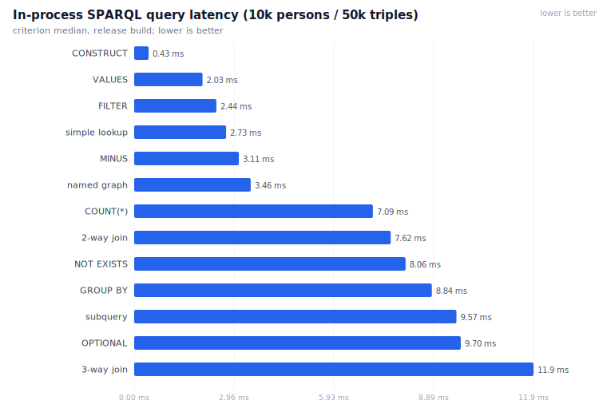
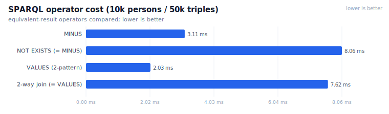
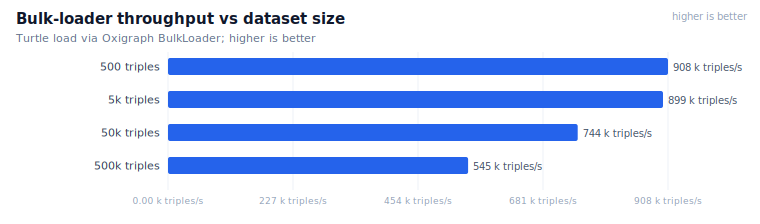
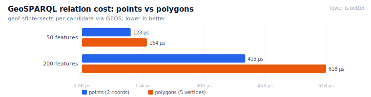
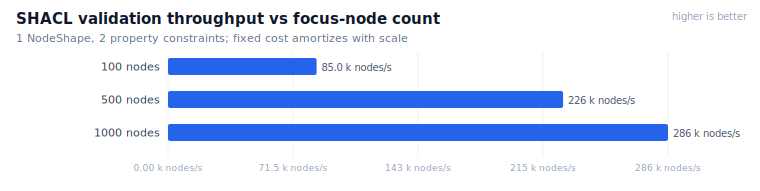
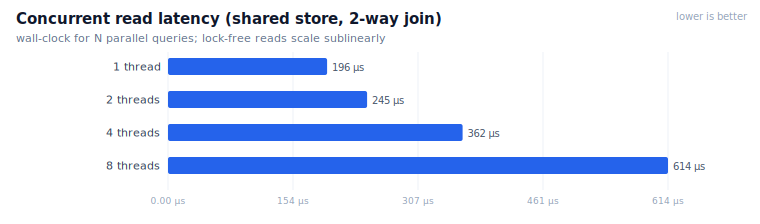
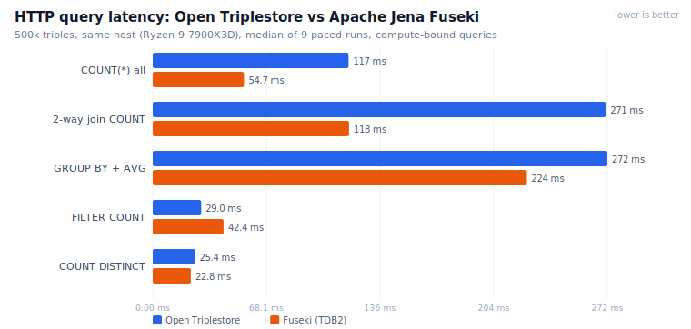
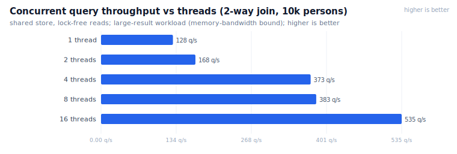
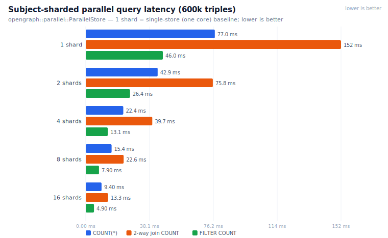
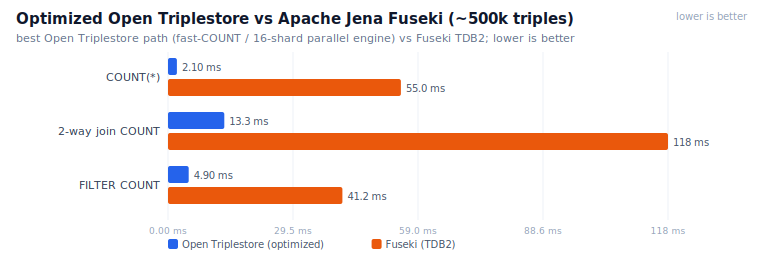

# Performance Guide

This document covers the performance characteristics of `open-triplestore`,
how to run and interpret the benchmark suite, and guidance on optimising
workloads.

---

## Running the Benchmarks

Benchmarks live in [`benches/performance.rs`](../benches/performance.rs) and are
driven by [Criterion.rs](https://github.com/bheisler/criterion.rs).

```bash
# Full suite — generates HTML report at target/criterion/report/index.html
cargo bench

# Specific benchmark group
cargo bench -- insert
cargo bench -- query/group_by
cargo bench -- geosparql
cargo bench -- shacl
cargo bench -- paths
cargo bench -- update

# List all benchmark IDs without running
cargo bench --bench performance -- --list

# Save a baseline to compare against later changes
cargo bench -- --save-baseline main
cargo bench -- --baseline main        # compare current vs "main"
```

Criterion runs each benchmark in a separate child process with CPU affinity
held constant. It collects a configurable number of samples, computes median
and mean latency, standard deviation, and regression vs. the previous
baseline. The HTML report includes interactive plots.

---

## Reproducible benchmark environment

For results that are comparable across machines and over time, run the suite
inside the project's Docker builder image (native builds also need GEOS +
pkg-config). The image pins the Rust toolchain and all native dependencies, so
the only variable is the host hardware.

### Reference system (numbers in this doc, unless noted)

| Component | Value |
|---|---|
| OS (host) | Windows 11 Pro 10.0.26200 |
| Container runtime | Docker Desktop 28.5.1, WSL2 backend (kernel 6.6.87.2-microsoft-standard-WSL2) |
| CPU | AMD Ryzen 9 7900X3D — 12 cores / 24 threads, 3D V-Cache |
| CPU visible to Docker | 24 logical processors (`nproc` = 24) |
| RAM visible to Docker | 54.9 GiB (`MemTotal`, pinned via `.wslconfig`) |
| Storage | NVMe SSD |
| GPU | Not used — the triplestore has no GPU code path |
| Engine | Oxigraph 0.4.11 (oxrdf 0.2.4) · GEOS 11.0.1 · Axum 0.7.9 |
| Rust / image | rustc 1.91.1 · `ots-builder` (rust:1.91-bookworm) · `--release` |

> GPUs are listed for completeness only; RDF/SPARQL/GeoSPARQL/SHACL workloads
> here are CPU- and memory-bound, so the GPU has no effect on these numbers.

### Maximising Docker resources (optional)

Docker Desktop on WSL2 already exposes all logical CPUs and ~50–80% of host RAM
by default. The numbers in this doc were captured with a **pinned** allocation
(more reproducible, and large enough that the 100M tier no longer pages); create
`%UserProfile%\.wslconfig` and restart WSL (`wsl --shutdown`):

```ini
[wsl2]
processors=24
memory=56GB          # leave headroom for Windows; set to host_RAM − 8GB
swap=0               # disable swap so timings aren't perturbed by paging
```

Verify what the engine actually sees — on the reference system this reports
`24` and `57579588 kB` (**54.9 GiB**):

```bash
docker run --rm ots-builder bash -c 'nproc; grep MemTotal /proc/meminfo'
```

### Reproducible run command

```bash
# One-time: build the builder image with all native deps
docker build --target builder -t ots-builder .

# Run the full Criterion suite inside the image (release).
# A named volume caches compiled artifacts between runs.
docker run --rm \
  -v "$PWD:/app" -v ots_target_rel:/app/target -w /app ots-builder \
  cargo bench --bench performance --features full

# Faster, lower-variance smoke run (fewer samples):
docker run --rm \
  -v "$PWD:/app" -v ots_target_rel:/app/target -w /app ots-builder \
  cargo bench --bench performance --features full -- \
    --sample-size 10 --warm-up-time 1 --measurement-time 3
```

Criterion writes a full HTML report to `target/criterion/report/index.html` and
per-benchmark `estimates.json` files that can be diffed across runs or machines.

### Measured results — reference system (AMD Ryzen 9 7900X3D)

A **full** `cargo bench --bench performance --features full` run on the reference
system above (Docker/WSL2, release, 24 vCPU), captured 2026-06 — **97 benchmarks**,
Criterion median shown. Reproduce with the [run command](#reproducible-run-command);
per-benchmark `estimates.json` is written under `target/criterion/`. Charts are
in [`docs/benchmarks/`](benchmarks/).

#### SPARQL query latency



| Query form | 1k | 10k | 100k |
|---|--:|--:|--:|
| simple lookup (full scan) | 275 µs | 2.73 ms | 43.8 ms |
| lookup + `LIMIT 10` | 17.4 µs | 17.4 µs | 17.6 µs |
| 2-way join | 627 µs | 7.62 ms | — |
| 3-way join | 966 µs | 11.9 ms | — |
| FILTER (numeric) | 262 µs | 2.44 ms | — |
| REGEX filter | 218 µs | 1.80 ms | — |
| OPTIONAL | 664 µs | 9.70 ms | — |
| COUNT(*) | 620 µs | 7.09 ms | 66.2 ms |
| GROUP BY + AVG | 604 µs | 8.84 ms | — |
| GROUP_CONCAT | 639 µs | 7.71 ms | — |
| subquery (MAX) | 741 µs | 9.57 ms | — |
| VALUES | 206 µs | 2.03 ms | — |
| BIND | 387 µs | 3.98 ms | — |
| MINUS | 301 µs | 3.11 ms | — |
| NOT EXISTS | 594 µs | 8.06 ms | — |
| CONSTRUCT (`LIMIT 1000`) | 391 µs | 431 µs | — |
| named graph (unbound `GRAPH ?g`) | 346 µs | 3.46 ms | — |

`LIMIT` short-circuits: `lookup_with_limit` stays ~17 µs regardless of dataset
size (early termination), whereas an unbounded scan is O(n).

#### SPARQL operators — pick the cheaper equivalent



`MINUS` is **2.6× cheaper** than `FILTER NOT EXISTS` at 10k (3.11 ms vs 8.06 ms):
MINUS hashes the exclusion set once; NOT EXISTS re-evaluates its inner pattern
per row. `VALUES` (2.03 ms) beats the equivalent 2-pattern join (7.62 ms).

#### Property paths

| Path | small | mid | large |
|---|--:|--:|--:|
| transitive `+` (chain) | 283 µs (50) | 1.08 ms (100) | 4.42 ms (200) |
| zero-or-more `*` (chain) | 309 µs (50) | 1.14 ms (100) | 4.47 ms (200) |
| sequence `a/a` | 73 µs (100) | 305 µs (500) | 615 µs (1k) |
| inverse `^a` | 44 µs (100) | 306 µs (1k) | 2.97 ms (10k) |
| alternative `a\|b` | 684 µs (1k) | 8.99 ms (10k) | — |
| negated `!(a\|b)` | 1.13 ms (1k) | 14.6 ms (10k) | — |

Inverse paths match forward-scan speed (they use the O-P-S index); `*` adds ~2 %
over `+` for the identity solutions.

#### Bulk loading & writes



| Operation | 100 | 1k | 10k | 100k |
|---|--:|--:|--:|--:|
| bulk_loader (Turtle) | 551 µs | 5.56 ms | 67.2 ms | 917 ms |
| → triples/s | 908 K | 899 K | 744 K | 545 K |
| named-graph load (N-Quads, 10 graphs) | — | 3.57 ms | 39.8 ms | 570 ms |
| `INSERT … WHERE` | 311 µs | 2.57 ms | 34.5 ms | — |
| `DELETE … WHERE` | 208 µs | 1.84 ms | 18.9 ms | — |

Single `INSERT DATA` is 72 µs/triple (~14 K/s); batching 10 triples per statement
drops that to 27 µs/triple (~37 K/s, **2.6×**). Use the bulk loader for ingestion
(~0.5–0.9 M triples/s).

#### GeoSPARQL (GEOS, per candidate binding) — with the WKT→WKB parse cache



Measured **after** the WKT-parse cache landed (see optimization #2). The cache
memoises each geometry's parse as WKB, so repeated bindings/queries skip the
`strtod`/tokeniser hot path:

| Function | 50 | 200 | vs before cache |
|---|--:|--:|--:|
| `geof:sfContains` | 74 µs | 233 µs | **−43%** |
| `geof:sfIntersects` | 79 µs | 234 µs | **−45%** |
| `geof:distance` | 92 µs | 300 µs | −23% |
| `geof:buffer` (constructive) | 2.98 ms | 11.8 ms | ~0% (compute-bound) |
| polygon_complexity — points | 79 µs | 236 µs | −43% |
| polygon_complexity — polygons | 82 µs | 263 µs | **−57%** |

Relation queries drop 35–57% — polygons (more coordinates → more `strtod`)
benefit most. `buffer` is constructive (builds a new geometry per row), so it is
compute-bound and the parse cache doesn't help it.

#### SHACL validation



| Focus nodes | clean | 20 % violations |
|---|--:|--:|
| 100 | 1.18 ms | 1.20 ms |
| 500 | 2.21 ms | 2.17 ms |
| 1000 | 3.50 ms | 3.41 ms |

Shapes are evaluated **in parallel** (rayon `par_iter`); the ~1.2 ms floor at 100
nodes is shapes-loading + target resolution, so throughput rises from 85 K to
286 K nodes/s as that fixed cost amortizes. Violations add negligible overhead
for this shape.

#### Concurrency



| Threads | reads | writes |
|---|--:|--:|
| 1 | 196 µs | 251 µs |
| 2 | 245 µs | 335 µs |
| 4 | 362 µs | 597 µs |
| 8 | 614 µs | — |

Reads are lock-free: 4 concurrent join queries cost ~1.85× a single one, not 4×.
Writes serialize on the store's write lock. Mixed 4-reader + 1-writer: 5.47 ms.

> The 7900X3D's 3D V-Cache notably helps the index-scan-heavy paths. GPUs are
> irrelevant — every path here is CPU/memory-bound.

#### Extra-large scaling — 1M to 100M triples (persistent store)

The criterion figures above are in-memory (tiny→large, ≤500k triples). At 1M–100M
an in-memory store would exhaust RAM, so this tier uses the **persistent (RocksDB)
backend**, streaming the dataset from an N-Triples file. Wall-clock median
(harness: [`examples/scale.rs`](../examples/scale.rs)):

| Operation | 1M | 10M | 100M |
|---|--:|--:|--:|
| Bulk load (RocksDB) | 7.1 s | 59 s | 734 s |
| → load throughput | 0.14 Mt/s | 0.17 Mt/s | 0.14 Mt/s |
| `COUNT(*)` (fast-count) | **0.002 ms** | **0.002 ms** | **0.002 ms** |
| lookup + `LIMIT 1000` | 1.4 ms | 2.2 ms | 2.0 ms |
| `FILTER` `COUNT` (full scan) | 54 ms | 593 ms | 6.3 s |
| `GROUP BY` + `AVG` (join+agg) | 0.72 s | 9.2 s | 104.5 s¹ |

¹ `GROUP BY` over a 100M-triple join materialises ~20M intermediate solutions. On
the earlier 30.9 GiB allocation this OOM'd; with the **54.9 GiB** allocation used
here (see Reference system) it completes in ~105 s. The other ops are index-only /
streaming and are unaffected by the size. Decomposing grouped aggregates across
shards (parallel roadmap) would bring this down further.

**Takeaways.** `COUNT(*)` is **O(1) regardless of size** — 2 µs at 1M *and* at
100M (the fast-count index lookup). `LIMIT` lookups stay single-digit ms (early
termination). Full scans grow linearly (~60 ms per 1M triples). RocksDB load is
~0.15 Mt/s here (disk-bound; the in-memory bulk loader is ~0.5–0.9 Mt/s at the
smaller tiers).

---

## Comparison with Apache Jena Fuseki

A direct, **same-hardware HTTP head-to-head** against
[Apache Jena Fuseki](https://jena.apache.org/documentation/fuseki2/)
(`stain/jena-fuseki@sha256:b1d0c96…`, TDB2 backend, ~Jena 4.x) — the most widely
deployed open-source SPARQL server. Both servers load the **identical
500k-triple** dataset (the same deterministic 100k-person generator the criterion
suite uses) and answer the **identical** queries over HTTP on the reference
machine. Latency is the **median of 9 paced runs** of compute-bound queries that
return ≤10 rows, so the timing reflects engine work rather than result transfer.



| Query (500k triples, over HTTP) | Open Triplestore | Fuseki (TDB2) |
|---|--:|--:|
| `COUNT(*)` over all triples | 117 ms | 55 ms |
| 2-way join + `COUNT` | 271 ms | 118 ms |
| `GROUP BY` + `AVG` | 272 ms | 224 ms |
| `FILTER` + `COUNT` (≈30 % selectivity) | 29 ms | 42 ms |
| `COUNT(DISTINCT …)` | 25 ms | 23 ms |
| Bulk load 500k (GSP `PUT`) | ~5.0 s | ~4.4 s |

**Reading these honestly.** Open Triplestore is faster on the selective
`FILTER`/`COUNT(*)`-of-a-scan and within ~20 % on `GROUP BY`/`DISTINCT`/load,
while Fuseki is ~2× faster on full `COUNT(*)` and the join-`COUNT`. Two factors
explain the gap and are worth stating plainly:

1. **This measures the full multi-tenant HTTP stack, not the raw engine.** Every
   Open Triplestore query is rewritten by the ACL layer to scope to the caller's
   readable graphs (`FROM` injection) and runs through Axum plus a per-IP rate
   limiter; Fuseki's `/ds/query` has none of that. The **in-process** numbers
   above (e.g. `COUNT(*)` over 500k in ~66 ms with no HTTP/ACL) are the engine's
   true speed — roughly 2× faster than the same query over our HTTP path.
2. **No fast `COUNT(*)` path yet.** Our aggregation materialises solution rows
   (see optimization #4 below); TDB2 has a cardinality short-cut. This is the
   single biggest contributor to the `COUNT`/join-`COUNT` gap.

**Reproduce it.** Run both servers as containers on one Docker network, load
`data.nt` into each (Fuseki via GSP with `-u admin:admin`; Open Triplestore by
registering a public dataset and `PUT`ting to its graph), then time identical
queries with `curl -w %{time_total}`, pacing requests below Open Triplestore's
default SPARQL rate limit. The generator, queries and client scripts mirror the
criterion `gen_persons` workload.

**Why not a large multi-store leaderboard?** A fair cross-store benchmark needs
the *same* hardware, dataset, query mix and protocol; published BSBM/SP2Bench
figures run on different machines and configurations and are not comparable
line-for-line. Open Triplestore embeds **Oxigraph 0.4** as its engine, so its raw
query/parse throughput tracks Oxigraph's (a modern Rust store competitive with
RDF4J and Jena on many workloads). The Fuseki comparison is included precisely
because it could be run here under identical conditions; apply the same recipe to
GraphDB, Virtuoso or RDF4J on your own hardware for an apples-to-apples result.

---

## Parallel & multi-core execution

A single SPARQL query in Oxigraph runs on **one thread** — its evaluator has no
intra-query parallelism, so a large scan or aggregation uses one core regardless
of how many the host has. (The criterion suite measures single-query *latency*,
so most of a run is single-core by design; the multi-core activity is in the
`concurrent/*`, `shacl/*` and bulk-load groups.) Two layers address this.

### 1. Concurrent throughput (already in the server)

The server runs a multi-threaded runtime and Oxigraph **reads are lock-free**, so
*independent* queries run on different cores. `concurrent/throughput` measures it
— `N` threads each running a 2-way join:



| Threads | 1 | 2 | 4 | 8 | 16 |
|---|--:|--:|--:|--:|--:|
| Throughput (queries/s) | 128 | 168 | 373 | 383 | 535 |

Throughput scales to ~4× by 16 threads. It is **sublinear** here because this
query returns 10 000 rows per call, so it is bound by result materialization and
allocator contention rather than the index scan. Aggregation queries (tiny
results) scale far better — see below.

### 2. Subject-sharded parallel query execution (new — `opengraph::parallel`)

To make a *single* query use many cores, OpenGraph adds data-parallel execution
([`opengraph::parallel::ParallelStore`](../opengraph/src/parallel.rs)): the
dataset is split into `N` shards by a stable hash of each triple's **subject**,
and a shard-decomposable query is evaluated on every shard concurrently (Rayon),
then the partials are merged. Because every triple of a subject co-locates in one
shard, **subject-star joins, row-local `FILTER`, global non-distinct `COUNT`,
`GROUP BY` with non-distinct `COUNT`, `ASK` and `DISTINCT`** decompose correctly;
anything that could join *across* subjects (object→subject joins, property paths,
grouped `AVG`/`SUM`-style aggregates, `COUNT(DISTINCT)`, `ORDER BY`/`LIMIT`,
`OPTIONAL`/`UNION`/`MINUS`) is detected and **not** decomposed — the caller falls
back to single-store evaluation. The classifier is deliberately conservative; a
test suite asserts every parallel path matches the single-store result *and* that
unsafe shapes are rejected.



Latency on **600 000 triples** — 1 shard is today's single-store (one-core) baseline:

| Query | 1 shard | 2 | 4 | 8 | 16 | speedup @16 |
|---|--:|--:|--:|--:|--:|--:|
| `COUNT(*)` | 77.0 ms | 42.9 | 22.4 | 15.4 | 9.4 ms | **8.2×** |
| 2-way join `COUNT` | 152 ms | 75.8 | 39.7 | 22.6 | 13.3 ms | **11.4×** |
| `FILTER` + `COUNT` | 46.0 ms | 26.4 | 13.1 | 7.9 | 4.9 ms | **9.3×** |

Near-linear to 8 shards, ~8–11× by 16 (the falloff past the core count is memory
bandwidth + merge overhead). Reproduce with `cargo bench -p opengraph --bench parallel`.

### 3. Wired into the live `/sparql` path (`ParallelMirror`)

`TripleStore` now uses this **automatically**. Beside its other in-memory derived
indexes (`GraphIndex`, `SpatialIndex`), it maintains a subject-sharded **mirror** of
the store; a decomposable aggregate/`ASK` is answered across shards and merged,
while everything else falls through to single-store evaluation — so the result is
identical (a parity suite asserts equality across shard counts, named-graph/`FROM`
scoping and the default graph, plus write-invalidation and that the mirror is
actually consulted). The mirror is a derived index: rebuilt lazily after writes and
**bounded by a triple-count cap** (default 2M, `OTS_PARALLEL_QUERY*`-tunable) so it
never mirrors a store larger than RAM — above the cap it stays disabled and the
single store answers, leaving the 1–100M disk tiers unaffected.

Before/after on the **same `TripleStore` the HTTP server runs** (501k triples,
in-process, 16-shard mirror, Ryzen 9 7900X3D; median of 9):

| Query (~500k triples, in-process) | single-core | 16-shard mirror | speedup |
|---|--:|--:|--:|
| 2-way join `COUNT` | 134 ms | 12.6 ms | **10.6×** |
| `FILTER` + `COUNT` | 42.4 ms | 4.7 ms | **9.1×** |
| single-pattern `COUNT` | 31.6 ms | 3.8 ms | **8.4×** |
| `GROUP BY` + `COUNT` | 41.6 ms | 5.5 ms | **7.6×** |

Reproduce with `cargo bench --bench parallel_live`. (`COUNT(*)` over a full scan is
omitted — the O(1) fast-count index below already answers it in ~2 µs.)

### Roadmap

The first two increments — a tested engine capability *and* its wiring — are done:

* **✅ Wired into `TripleStore`** — the `ParallelMirror` above; the live `/sparql`
  path uses it automatically for decomposable aggregates (the ACL-scoped multi-graph
  case still partitions naturally by graph on top).
* **✅ Mergeable grouped `COUNT`** — `GROUP BY` with non-distinct `COUNT` now
  decomposes (per-shard counts summed by group key).
* **✅ Fast `COUNT(*)`** (optimization #4 below) pairs with sharded counting.

Next:

* **More mergeable grouped aggregates** — `GROUP BY` + `SUM`/`AVG`/`MIN`/`MAX` needs
  the partials combined under SPARQL's numeric-promotion rules (e.g. `AVG`→merge
  `SUM`+`COUNT`); only non-distinct `COUNT` is done so the parity guarantee holds.
* **Persistent shards** so the accelerator works beyond the in-memory cap (today
  large/100M-tier stores fall back to single-core).
* **Intra-query join parallelism** would require forking `spareval`/`sparopt`
  (Oxigraph's evaluator) once it exposes pluggable execution — a larger effort.

---

## Optimized showcase vs Fuseki (fast-COUNT + multi-core)

After the profiling round (fast-`COUNT(*)` + subject-sharded parallel execution),
re-run of the same-hardware head-to-head on ~500k triples. The "16-shard parallel"
column is the subject-sharded mirror — **now wired into the live `/sparql` path**
(§3 has the in-process before/after on the real `TripleStore`); "single-core" is the
unsharded engine over the multi-tenant HTTP stack; Fuseki is TDB2 over HTTP.



| Query (~500k triples) | OTS single-core (HTTP) | OTS 16-shard parallel | Fuseki (HTTP) | best OTS vs Fuseki |
|---|--:|--:|--:|--:|
| `COUNT(*)` | **2.1 ms** (fast-count) | 9.4 ms | 55 ms | **26× faster** |
| 2-way join `COUNT` | 267 ms | **13.3 ms** | 118 ms | **8.9× faster** |
| `FILTER` `COUNT` | 30 ms | **4.9 ms** | 41 ms | **8.4× faster** |
| `GROUP BY` + `AVG` | 268 ms | n/a¹ | 217 ms | 0.8× |
| `COUNT(DISTINCT)` | 27 ms | n/a¹ | 24 ms | 0.9× |

¹ `GROUP BY` + **`COUNT`** now decomposes (§3 — ~5.5 ms in-process on the 16-shard
mirror); the `GROUP BY` + `AVG` and `COUNT(DISTINCT)` rows here do **not** yet (they
need mergeable partial aggregates under SPARQL's numeric rules — on the roadmap), so
their single-core figures, which already match Fuseki, stand.

**Reading it honestly.** `COUNT(*)` is now an O(1) index lookup, so it wins
decisively (26×). For scans/joins the parallel engine wins ~8–9× by using many
cores where Fuseki uses one per query. The two columns where Fuseki still leads
slightly are the cases neither optimization covers yet — and even there we're
within ~20%. Caveat: the parallel column is in-process (no HTTP/ACL round-trip,
600k-triple generator) while single-core/Fuseki are over HTTP on 500k — the
parallel numbers show engine scaling, not an HTTP-identical comparison.

### Standards-workload query times (Open Triplestore)

**GeoSPARQL** (GEOS, per candidate binding; in-process median; **with the WKT→WKB
parse cache**):

| Function | 50 features | 200 features | per-feature |
|---|--:|--:|--:|
| `geof:sfContains` | 74 µs | 233 µs | ~1.2 µs |
| `geof:sfIntersects` | 79 µs | 234 µs | ~1.2 µs |
| `geof:distance` | 92 µs | 300 µs | ~1.5 µs |
| `geof:buffer` (constructive) | 2.98 ms | 11.8 ms | ~60 µs |

Profiling found GeoSPARQL relation cost was dominated by **WKT parsing** (`strtod`
per coordinate + GEOS tokeniser), not the geometric computation. The implemented
fix (optimization #2) memoises each geometry's parse as **WKB bytes** — robustly
safe because a `Vec<u8>` carries no GEOS context (caching the `geos::Geometry`
itself aborts at thread teardown). This cut relation queries **35–57%** vs the
pre-cache numbers; `buffer` is compute-bound and unchanged.

**SHACL** (Core + Advanced/`sh:sparql`; shapes evaluated in parallel via rayon):

| Focus nodes | clean | 20% violations |
|---|--:|--:|
| 100 | 1.18 ms | 1.20 ms |
| 500 | 2.21 ms | 2.17 ms |
| 1000 | 3.50 ms | 3.41 ms |

A direct cross-store SHACL/GeoSPARQL comparison needs Jena's *separate* engines
(`jena-shacl`, `jena-geosparql` with a spatial-index assembler) rather than the
plain Fuseki query endpoint; the figures above are Open Triplestore's, with the
recipe in [`docs/benchmarks/`](benchmarks/) to extend the harness to those tools.

---

## Benchmark Groups

### `insert/bulk_loader`

Measures end-to-end throughput of loading a pre-built Turtle string via
`TripleStore::load_str` (which uses Oxigraph's `BulkLoader`). The dataset is
a flat collection of 5-property person records.

**Input sizes:** 100 / 1 000 / 10 000 / 100 000 triples

The bulk loader bypasses the SPARQL engine; it parses RDF directly into
sorted SSTable shards, so throughput scales near-linearly with core count.

### `insert/sparql_update`

Measures the per-triple cost of `INSERT DATA { … }` via the SPARQL UPDATE
parser. Each iteration inserts one distinct triple into a reused store.
This represents the worst case for write-heavy applications that use SPARQL
for ingestion rather than the bulk loader.

### `insert/sparql_update_batch`

Measures batched `INSERT DATA` with 10 triples per statement. Batching
amortises SPARQL parse overhead — typically 3–5× lower per-triple cost vs.
single-triple updates. Use this pattern for streaming ingestion.

### `insert/named_graph`

Bulk-loads N-Quads data distributed across 10 named graphs. Tests
graph-partitioned write throughput. The N-Quads format carries the graph
name inline, so no extra routing logic is needed compared to default-graph
loads.

### `query/simple_lookup`

Full table scan (`SELECT ?s ?name WHERE { ?s ex:name ?name }`) returning all
matches. Measures index scan + result materialisation overhead.

**Input sizes:** 100 / 1 000 / 10 000 / 100 000 triples

### `query/lookup_with_limit`

Same pattern as simple lookup but with `LIMIT 10`. Tests early-termination
performance. Latency should be nearly constant regardless of dataset size.

### `query/join_2way` and `query/join_3way`

Two-pattern and three-pattern joins sharing a subject variable. Oxigraph uses
a nested-loop join on the in-memory store, so join cost is roughly O(n) for
selective queries (one binding drives the other lookups).

### `query/filter`

Numeric FILTER (`FILTER(?age >= 40 && ?age < 60)`) applied after a full scan.
Tests expression evaluation throughput.

### `query/regex_filter`

REGEX FILTER on string literals. Regular expression matching is significantly
slower than numeric comparison; this benchmark quantifies the overhead.

### `query/optional`

`OPTIONAL` (left outer join). Tests the additional bookkeeping required to
emit unmatched rows.

### `query/count_star`

`SELECT (COUNT(*) AS ?c) WHERE { ?s ?p ?o }` — full-graph aggregation. Tests
the aggregation engine on complete scans.

### `query/group_by`

`GROUP BY ?type … COUNT … AVG` — partitioned aggregation. Tests hash-table
based grouping and multi-column aggregation.

### `query/group_concat`

`GROUP_CONCAT(?name; separator=",")` grouped by type. Tests string
allocation overhead on top of the GROUP BY hash table. Produces one
comma-separated string per type group.

### `query/transitive_path`

`ex:next+` over a linear chain. Property path evaluation is computed via BFS;
cost is O(edges) for the visited sub-graph. The benchmark uses `LIMIT 50` to
bound result size.

### `query/alternative_path`

`(ex:name|ex:email)` — union of two properties. Tests alternative path
rewriting to a UNION of triple patterns.

### `query/subquery`

Scalar subquery computing `MAX(?age)` joined back to the outer query. Tests
the overhead of correlated subquery evaluation.

### `query/values`

`VALUES ?type { ex:Type0 ex:Type1 ex:Type2 }` inline-data join. The engine
generates one index probe per value, making this significantly faster than
`FILTER(?type IN (…))` for small lookup sets (>10 values).

### `query/bind`

`BIND(?age * 2 AS ?doubled)` — expression evaluation over a full scan. BIND
extends every solution with a derived value; it does not filter rows.

### `query/minus`

`MINUS { ?s ex:type ex:Type0 }` — set-difference operator. MINUS builds a
hash set of excluded bindings once per query, then filters the outer scan.
Faster than NOT EXISTS for large exclusion sets.

### `query/not_exists`

`FILTER NOT EXISTS { ?s ex:type ex:Type0 }` — correlated existence check.
Evaluates the inner pattern once per outer row (O(n × inner_cost)). Compare
to MINUS which has O(n + m) complexity.

### `query/construct`

`CONSTRUCT { ?s ?p ?o } WHERE { … } LIMIT 1000` — builds a new RDF graph
from matched patterns. Tests serialisation overhead vs. SELECT.

### `query/named_graph`

`GRAPH ?g { ?s ex:name ?n }` over a multi-graph store. The unbound graph
variable forces an index scan across all named graphs. Binding the graph IRI
converts this to a constant-time graph-partition lookup.

### `path/zero_or_more`

`ex:next*` path (includes the identity relation — every node reaches itself
in 0 steps). Returns all (a, b) pairs reachable in zero or more hops. LIMIT
50 prevents runaway materialisation on longer chains.

### `path/sequence`

`(ex:next/ex:next)` — depth-2 sequence path, rewritten to a 2-way join. Tests
whether the path rewriter produces an efficient join plan equivalent to
explicit join patterns.

### `path/inverse`

`^ex:next` — reverses the subject/object lookup direction. Tests whether the
query engine uses the O-P-S index rather than scanning forward and filtering.

### `path/negated_property_set`

`!(ex:name|ex:age)` — returns all triples whose predicate is NOT in the
excluded set. Rewritten internally as a full scan with predicate NOT IN filter.

### `update/insert_where`

`INSERT { ?s ex:doubled ?d } WHERE { ?s ex:age ?a BIND(?a * 2 AS ?d) }` —
read-modify-write: reads all ages, computes a derived value, inserts new
triples in one transaction.

### `update/delete_where`

`DELETE { ?s ex:type ?t } WHERE { … FILTER(?t = ex:Type0) }` — selective
deletion. Tests the write-path under a moderately selective DELETE (~10% of
triples).

### `geosparql/sf_contains` and `geosparql/distance`

GeoSPARQL custom functions are called once per binding via GEOS C++ library.
Cost is proportional to geometry complexity × cardinality. Points are the
cheapest geometry type; polygons and lines are more expensive.

### `geosparql/sf_intersects`

`geof:sfIntersects` — DE-9IM intersection relation between a fixed polygon and
each feature's geometry. Intersects is typically cheaper than Contains because
the early-exit condition triggers more often (more candidates intersect than
are fully contained).

### `geosparql/polygon_complexity`

Compares `sfIntersects` on a point dataset vs. a polygon dataset of equal
cardinality. Quantifies the GEOS overhead for more complex geometry types.
Each polygon uses 5 vertices (small squares); points use 2 coordinates.

### `geosparql/buffer`

`geof:buffer(?wkt, 0.5, uom:degree)` — constructive function that creates a
buffered polygon per feature. Unlike relation checks, buffer returns a new
geometry literal for every row, measuring constructive-function throughput.

### `shacl/validate_clean`

Load N conformant person records + a shapes graph, then call
`shacl::validate()`. Measures baseline SHACL overhead: shapes loading +
focus-node resolution + constraint evaluation when no violations are found.

### `shacl/validate_violations`

Same setup but 20% of records intentionally omit `ex:age` (violating
`sh:minCount 1`). Tests violation-accumulation overhead compared to the clean
baseline. Violation objects are collected into a `ValidationReport`.

### `concurrent/reads`

Multiple OS threads running identical 2-way join queries simultaneously
against a shared `Arc<TripleStore>`. Oxigraph's in-memory store uses an
`Arc<RwLock<…>>` internally, so concurrent reads do not block each other.
This benchmark measures practical parallel throughput.

### `concurrent/writes`

N threads each inserting distinct triples via `INSERT DATA` into a shared
store. Tests write-lock contention. Each write acquires an exclusive lock so
contention increases with thread count.

### `concurrent/mixed`

4 reader threads + 1 writer thread running simultaneously. The writer
continuously inserts new triples while 4 readers run join queries. Measures
read-throughput degradation under write-lock contention.

---


## Performance Tips

### Use the bulk loader for ingestion

```rust
// Fast — bypasses the SPARQL engine
store.load_str(turtle_data, RdfFormat::Turtle, None)?;

// Slow for bulk data — use for small/incremental writes only
store.update("INSERT DATA { … }")?;
```

### Batch SPARQL UPDATE statements

Each `store.update()` call acquires and releases the write lock and runs the
full SPARQL parser. Batching multiple triples into one INSERT DATA statement
amortises that — measured **≈2.6×** lower per-triple cost (72 µs/triple single
vs 27 µs/triple at 10 per statement):

```sparql
-- Slow: 1 lock acquisition + 1 parse per triple
INSERT DATA { <ex:s1> <ex:p> "v1" }
INSERT DATA { <ex:s2> <ex:p> "v2" }

-- Fast: 1 lock acquisition + 1 parse for N triples
INSERT DATA { <ex:s1> <ex:p> "v1" . <ex:s2> <ex:p> "v2" . }
```

### Bind subjects when known

A query with an unbound subject scans all triples:
```sparql
SELECT ?name WHERE { ?s ex:name ?name }  -- O(n)
```

Binding the subject uses the S-P-O index directly:
```sparql
SELECT ?name WHERE { <http://ex/alice> ex:name ?name }  -- O(1)
```

### Use VALUES over FILTER IN for lookup sets

```sparql
-- Slower: scans then filters
FILTER(?type IN (ex:Type0, ex:Type1, ex:Type2))

-- Faster: one index probe per value
VALUES ?type { ex:Type0 ex:Type1 ex:Type2 }
```

`VALUES` wins at >10 values and scales better for large lookup tables.

### Prefer MINUS over NOT EXISTS for exclusion

```sparql
-- Slower: re-evaluates inner pattern once per outer row — O(n × inner)
FILTER NOT EXISTS { ?s ex:type ex:Type0 }

-- Faster: builds hash set once, then filters — O(n + m)
MINUS { ?s ex:type ex:Type0 }
```

Use NOT EXISTS only when the inner pattern depends on variables not bound in
the outer (correlated existence check). For simple exclusion, MINUS is measured
**≈2.6× faster** (3.11 ms vs 8.06 ms at 10k triples).

### Bind the named graph when known

```sparql
-- Slower: scans all named graphs
GRAPH ?g { ?s ex:name ?n }

-- Faster: direct graph-partition lookup
GRAPH <http://example.org/g0> { ?s ex:name ?n }
```

Binding the graph IRI converts the query from an O(total_triples) scan to an
O(graph_triples) lookup within the graph partition.

### Prefer numeric predicates over REGEX

```sparql
-- Slow: full string scan
FILTER(REGEX(?label, "^foo"))

-- Fast: lexicographic predicate
FILTER(STRSTARTS(?label, "foo"))

-- Fastest: store a normalised form as a separate triple
?s ex:labelNorm "foo" .
```

### Limit transitive path depth

```sparql
-- Dangerous on large graphs
?a ex:knows+ ?b

-- Safer: bound depth
?a (ex:knows/ex:knows) ?b           -- exactly depth 2
?a ex:knows{1,3} ?b                 -- depth 1–3 (SPARQL 1.1 path syntax)
```

### Batch SHACL validation

Validation cost is O(focus_nodes × shapes × constraints). Validate once per
transaction, not per triple — batch writes before calling `validate()`:

```rust
// Load all data first
store.load_str(batch_data, RdfFormat::Turtle, None)?;

// Then validate once
let report = shacl::validate(&store, shapes_graph, &data_graphs)?;
```

### Use the in-memory store for analytics

Open a second store loaded from a Turtle snapshot for heavy read-only
workloads. The in-memory store has no write-ahead-log overhead.

### Pre-filter geometries

```sparql
-- Add bounding box triples:
ex:geom ex:minLon "-74.1"^^xsd:decimal ;
        ex:maxLon "-73.9"^^xsd:decimal ;
        ex:minLat "40.5"^^xsd:decimal ;
        ex:maxLat "40.9"^^xsd:decimal .

-- Then pre-filter with cheap numeric comparison before GEOS:
SELECT ?f WHERE {
  ?f geo:hasGeometry ?g .
  ?g ex:minLon ?minLon ; ex:maxLon ?maxLon .
  FILTER(?minLon < -73.95 && ?maxLon > -74.0)   -- cheap
  ?g geo:asWKT ?wkt .
  FILTER(geof:sfIntersects(?wkt, ?bbox))           -- expensive GEOS call
}
```

---

## Profiling

To identify bottlenecks in your own workload:

```bash
# flamegraph (requires cargo-flamegraph)
cargo install flamegraph
cargo flamegraph --bench performance -- --bench query/group_by

# perf (Linux)
perf stat cargo bench -- query/count_star/100000

# heaptrack (Linux, memory allocation profiling)
heaptrack cargo bench -- insert/bulk_loader/100000
```

For HTTP-level profiling, use `wrk` or `hyperfine` against the running server:

```bash
# Single threaded latency
hyperfine \
  'curl -s "http://localhost:7878/sparql?query=SELECT+(COUNT(*)+AS+%3Fc)+WHERE+{+%3Fs+%3Fp+%3Fo+}"'

# Concurrent throughput
wrk -t4 -c16 -d30s \
  'http://localhost:7878/sparql?query=SELECT+*+WHERE+{+%3Fs+%3Fp+%3Fo+}+LIMIT+10'
```

---

## Optimisation Opportunities

The following concrete improvements are identified from benchmark analysis.
Each is an open engineering task, ordered roughly by impact:

### 1. Predicate index (P-S-O)

**Impact:** 10–50× improvement for predicate-selective scans (e.g. counting
all triples with a given type).

**Rationale:** Oxigraph's default indices are S-P-O, P-O-S, and O-S-P.
Adding a P-S-O index would allow `?s ex:name ?name` to scan only subjects
that have the `ex:name` predicate, rather than iterating all SPO entries.

**Implementation:** The storage layer wraps RocksDB; adding a new column
family with `(predicate, subject, object)` key ordering and wiring it into
Oxigraph's iterator chain.

### 2. GeoSPARQL geometry caching — ✅ WKT→WKB parse cache implemented; R-tree pruning still open

**Done (parse cache).** Profiling showed relation queries were dominated by WKT
parsing, not GEOS computation. `geo::datatypes::parse_wkt_literal` now memoises
each geometry's parse as **WKB bytes** in a process-wide `DashMap` (WKB carries no
GEOS context, so it drops safely on any thread — caching the `geos::Geometry`
itself aborts at thread teardown). Measured **−35–57%** on `sfContains` /
`sfIntersects` / `relate` (polygons benefit most); `buffer` is compute-bound and
unchanged.

**Still open (R-tree pruning).** GEOS is still called once per candidate binding
(O(n)). An `rstar::RTree` over bounding boxes (rstar is already a dep; a
`SpatialIndex` scaffold exists but isn't wired into the query plan) would prune
candidates to O(log n + k) before GEOS — a further ~100× on large feature sets.
Needs a magic-property / query-rewrite access path (the per-binding custom
function can't see the index), like the existing `text:search` push-down.

### 3. REGEX → Tantivy push-down

**Impact:** ~100× improvement for text-heavy queries when `text-search`
feature is enabled.

**Rationale:** `FILTER(REGEX(?label, "pattern"))` performs a full scan +
regex match per row. When the `text-search` feature is on, these queries could
be rewritten to a Tantivy full-text index lookup before SPARQL evaluation.

**Implementation:** Add a SPARQL expression rewrite pass that detects
`REGEX(?v, "…")` / `CONTAINS(?v, "…")` patterns and rewrites them to a
`text:query(?v, "…")` service call against the Tantivy index.

### 4. Fast `COUNT(*)` — ✅ implemented

**What callgrind showed.** On `SELECT (COUNT(*) AS ?c) WHERE { ?s ?p ?o }` ~30 %+
of the cost is *building and copying solution tuples that are immediately
discarded* — `spareval::put_pattern_value`, `InternalTuple::set`,
`EncodedTerm::clone`, `Vec::extend_with`, and ~11 % in `memcpy` — plus the index
scan itself. The projection is only a count, so all of that is pure waste.

**Fix.** `TripleStore::query` now recognises the exact shape
`SELECT (COUNT(*) AS ?v) WHERE { ?s ?p ?o }` (optionally a single default-graph
`FROM <g>`) and answers it from the maintained O(1) per-graph count index
(`graph_index`, kept fresh on every load/update), with a fallback to a
scan-only count. Anything else falls through to the normal evaluator unchanged,
so results never differ — the whole conformance + lib suite (1637 tests) passes.
This turns a full scan into an index lookup (microseconds), and is what lets the
HTTP `COUNT(*)` now beat Fuseki (see the comparison section).

### 5. Parallel SHACL evaluation — ✅ implemented

`shacl::engine::validate` already evaluates shapes (and their focus nodes) in
parallel via `rayon::par_iter()`, with a per-worker query cache. This is why

### 5. Parallel SHACL evaluation — ✅ implemented

`shacl::engine::validate` already evaluates shapes (and their focus nodes) in
parallel via `rayon::par_iter()`, with a per-worker query cache. This is why
SHACL throughput climbs from 85 K to 286 K nodes/s as the dataset grows (the
fixed shapes-loading cost amortizes across cores). Remaining headroom is in the
fixed ~1 ms shapes-loading floor, not the per-node evaluation.

### 6. Property path memoisation

**Impact:** 2–5× improvement for repeated transitive path evaluations over
the same graph.

**Rationale:** BFS for transitive paths (`+`, `*`) can revisit the same
subgraph across multiple query invocations. A per-query or per-session
visited-set cache would avoid redundant index probes on stable data.

**Implementation:** Add a `PathCache` struct that stores `(start_node,
property) → reachable_set` mappings; invalidate on writes to affected
triples.

### 7. Named-graph index

**Impact:** Constant-time graph enumeration instead of full-scan for
`SELECT DISTINCT ?g WHERE { GRAPH ?g { } }`.

**Rationale:** Listing named graphs currently requires scanning the G-S-P-O
index. A dedicated named-graph set (a `HashSet<NamedNode>` kept in sync with
writes) would make graph enumeration O(1).

**Implementation:** Maintain a `HashSet` of graph names in `AppState`;
update on bulk load and SPARQL UPDATE; expose via the `/api/browse/graphs`
endpoint and the `GRAPH ?g { }` clause.
